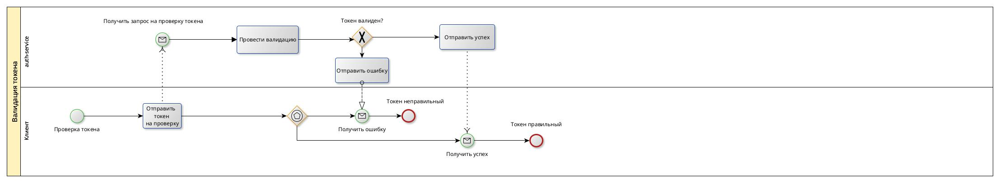

# Описание сервиса
Сервис для упрощенной настройки сетевого взаимодействия самодельных устройств на базе микроконтроллеров. 

Проблема: есть ряд энтузиастов, разрабатывающих различные устройства умного дома. При их создании есть простая возможность получить доступ к интернету с помощью WiFi/GSM модулей. Однако настроить удаленное взаимодействие требует создание либо виртуальной локальной сети, либо своего сервиса, что является достаточно трудоемкой задачей.

Предоставляемые возможности: сервис предоставляет функционал для простой настройки удаленного взаимодействия созданных пользователем устройств через графический интерфейс. Пользователю будут доступны:

1. регистрация устройства (добавление описания и токена доступа);
2. настройка буферов для хранения сообщений;
3. привязка устройства к буферу хранения сообщений для записи в него сообщений;
4. настройка взаимодействия данных при попадании в тот или иной буфер (переотправка их в другие буфферы по заданным правилам)

Количество схем взаимодействия, буфферов хранения, устройств и т.д. будет ограничено в зависимости от тарифа. 

# Use Case

# Примеры описания основных пользовательских сценариев

Сценарий 1: Пользователь регистрирует новое устройство
1. Вводятся параметры устройства: имя, описание.
2. Проверяются параметры, и если они корректны, то устройство сохраняется.
3. Пользователь обновляет токен доступа устройства: новый токен генерируется, сохраняется в таблицу токенов устрйоств и возвращается пользователю. 
4. Пользователь создает новый буфер сообщений или выбирает старый не привязанный ни к какому устройству и привязывает его к устройству.
5. Через графический интерфейс буфер с устройством добавляется на ту или иную схему взаимодействия. 

Сценарий 2: Пользователь редактирует схему взаимодействия.
1. На графический интерфйес добавляется новое устройство (пара устройство и привязанный буффер).
2. Стрлками настраивается пересылка сообщений между буферами устройств
3. Полученная схема преобразуется в json.
4. Сохраняется описание схемы и связи этой схемы с используемыми в ней буферами.

Сценарий 3: Устройство отпарвляет сообщений
1. На сервер отправляется сообщение и access токен устройства
2. Если он корректен, то сообщение добавляется в буфер и помечается как outcomming, связанный с устройством.
3. Загружаются параметры схемы, выбирается, в какие буферы отправить сообщение
4. В выбранный буферы загружается сообщение, помеченное как incomming

Сценарий 4: Устройство запрашивает входящее сообщение
1. На сервер отправляется access токен устройства.
2. Если он корректен, то возвращается самое старое сообщение из привязанного к устройству буфера, которое помечено как incomming.
3. Отправленное сообщение удаляется из буфера.

# ER-диаграмма сущностей

# Технологический стек

Бэкенд:
- Язык программирования: Java
- Фреймворки: Spring
- Брокер сообщений: Kafka
- БД: PostgreSQL

Фронтенд:
- React + Node.js

# Диаграмма БД

# Диаграмма компонентов

# BPMN

# Экраны

